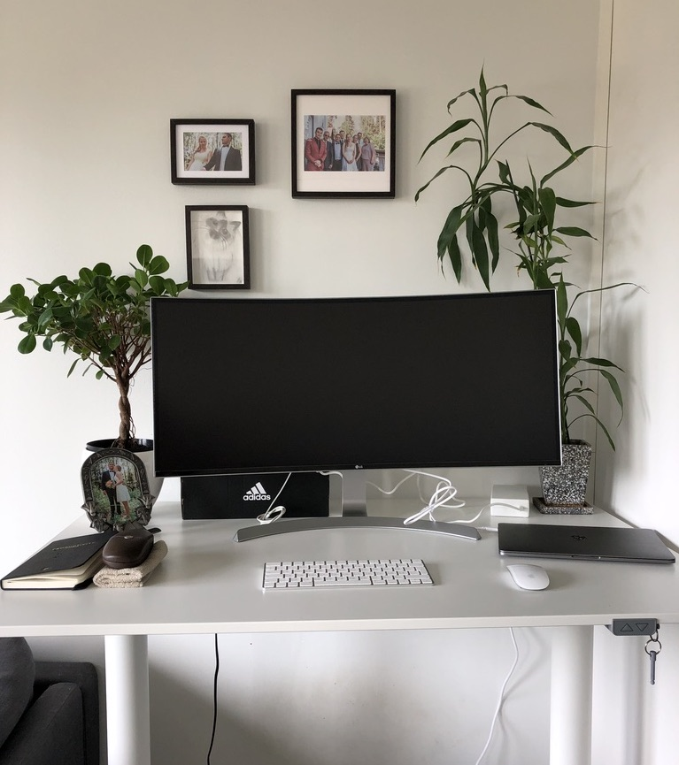

As of the time of writing this post, I started [my entrepreneurship experiment](/my-entrepreneurship-experiment) three weeks ago. 

I would like to share with you some of my progress & learnings so far.

At the end of every workweek, I sit down and reflect on my week.

I ask myself four questions:

- Weekly Wins. What went well? Any wins (big or little) this week?
- What didn't go according to the plan, what could be improved?
- What have I learned this week?
- What actions should I take next week to improve?

This post includes some of the notes I wrote in my journal answering these questions.

## Wins
Here are some of the things that have been going well for me recently:

### Blog redesign

I managed to finish the first version of my blog redesign. I received good feedback and have items to improve for the next update. That also resulted in small traction in terms of an increase in traffic.

### Accounting & Finance

Since I just established a company I have to learn about the operational kind of tasks. I made good progress in learning the basics of accounting, the Finnish tax system for companies and corporate law.

I managed to open a business bank account and I was fortunate enough to have a family member willing to help me with the accounting.

Now I have a basic system in place to handle taxes & accounting.

If you are starting a limited company in Finland soon and have any questions, feel free to drop me an email and I will try to help if I can.

### Work-environment Optimization

I enjoy working from home so I built my own little office. I got myself an ultra-widescreen, comfortable chair and I already had an electric standing table and other smaller accessories such as external keyboard & mouse. 

I enjoy my current distraction-free work environment where I can be most productive.

Here is how my home office looks like

### Freelance Agencies

As part of my initial plan, I will be dedicating 6 months per year for freelance projects. I had many good conversations with many recruiting agencies and already discussing with potential customers.

Here are some of the recruiting agencies I found in Helsinki:

- [Finitec](http://finitec.fi/)
- [Talented](http://talented.fi)
- [Siili One](https://campaign.siili.com/one)
- [Toughbyte](https://www.toughbyte.com/)
- [Codemen](http://codemen.fi/)
- [EWork Group](https://www.eworkgroup.com/fi)
- [ProData Consult](https://www.prodataconsult.com/)
- [Tentimes](https://www.tentimesagency.com/)

If you are a freelancer looking for gigs in Finland, you might also be interested in checking out my new service [Nordgigs](https://nordgigs.com).

### Nordgigs MVP

As part of my initial plan, I decided to experiment with a potential online product that would facilitate easily matching the supply & demand for freelancers.

I managed to build an initial minimal version of [Nordgigs](https://nordgigs.com). Soon, I will start to promote the service and collect feedback from potential customers. Looking forward to learn from the feedback to achieve product-market fit.

Feel free to check out the beta version at https://nordgigs.com and share any feedback with me via hello@nordgigs.com .

### Nordschool first video

I also kick-started my side project [nordschool](http://nordschool.com) where I will share my teaching material in terms of free & paid courses.

I created my first tutorial and there have been few views already. Nothing significant yet, but it is a good start.

## Didn't go according to the plan

### Video content

Creating video content is a new thing for me. It took some time for me to learn the tools necessary to record, edit & publish my content. However, now I think I learned the basics to keep me going.

### New Technology Stack

For [Nordgigs](https://nordgigs.com) I decided to use new technologies:
- Nuxt
- Vuex
- Serverless
- Netlify Functions
- FaunaDB.

Since that ecosystem is new to me, it took some time for me to be productive. I would say that this is typical for any new tool I use, it takes some time to get used to it. However, my estimates for how long it would take to build the [Nordgigs](https://nordgigs.com) MVP were a bit off.

### My weekly plans were too optimistic

My weekly plans didn't account for unexpected events. In the future, I need to leave some slack in my schedule and not be too harsh on myself when things don't go according to plan.

## Things I learned

Some of the things I learned about so far: 

- Video editing using [Davinici Resolve](https://www.blackmagicdesign.com/products/davinciresolve)
- Became more fluent with Nuxt, Vue & Vuex
- Basics of Accounting & Taxes.
- Company Agreements.
- Saas tools: [Zapier](https://zapier.com), [Mailchimp](http://mailchimp.com) & [FaunaDB](https://fauna.com)
- Serverless paradigm & [Netlify Functions](https://www.netlify.com/products/functions/).

## Actions to improve

To help me improve, here are some of the actions I need to commit.

### Better defined tasks.

I need to define my tasks in a way that are is concrete and actionable. If the task takes too long to accomplish I need to split divide it into multiple tasks. This would help me to stay focused and motivated.

### A system to block social media & email.

I have been struggling with distracting habits such as regularly checking social media and emails. I will design a system that regulates my social media & email usages and limits them to an acceptable level.

## Closing words

A quote that I found inspiring:

> We are what we repeatedly do. Excellence, then, is not an act, but a habit. - Aristotle

Let's pay attention to our habits.

------------

You can follow my progress by signing up for my [newsletter](/newsletter). 

Another way to find my experiment's updates is to check this [tag](/tag/my-entrepreuenrship-experiment), all the posts related will show up there.

Thanks for reading this far and until next time!

Ahmed

------------

Credits

Cover Photo by [Christopher Sardegna](hhttps://unsplash.com/@css) on [Unsplash](https://unsplash.com/photos/iRyGmA_no2Q)