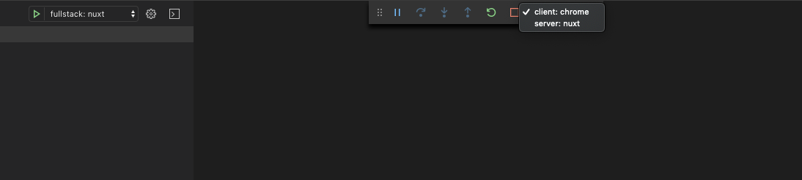

## The Problem

You need an easy way to debug your code through VS Code when working with nuxt & typescript.

## The Solution

Utilise Chrome & VS Code to have a better debugging experience. 

Add correct debugger configuration to VS Code & enable chrome debugging extension.
Create a custom logic to animate the scroll event using Typescript

### High level steps

- Add debugger configuration to VS Code.
- Update Nuxt config to include source map files.
- Add chrome debugging vs code extension. 
- Test debuggers.

### VS Code Debugger Configuration

We will start by adding the needed debugging configurations for VS Code to understand what to do when we start our debugger.

```json
// .vscode/launch.json
{
  "version": "0.2.0",
  "configurations": [
    {
      "type": "chrome",
      "request": "launch",
      "name": "client: chrome",
      "url": "http://localhost:{ADD_YOUR_APP_PORT_HERE}",
      "webRoot": "${workspaceFolder}"
    },
    {
      "type": "node",
      "request": "launch",
      "name": "server: nuxt",
      "args": ["dev"],
      "osx": {
        "program": "${workspaceFolder}/node_modules/.bin/nuxt-ts"
      },
      "linux": {
        "program": "${workspaceFolder}/node_modules/.bin/nuxt-ts"
      }
    }
  ],
  "compounds": [
    {
      "name": "fullstack: nuxt",
      "configurations": ["server: nuxt", "client: chrome"]
    }
  ]
}
```
The JSON file simply defines 2 configurations. 

**client: chrome** is the config necessary to debug any code that is run on the browser side.

**server: nuxt** is the config necessary to debug any code that is run on the server.

Depending on the mode you are running Nuxt in, you might need either both or only the client one.

The JSON configs also defines a compound command.

**fullstack: nuxt** combines both configurations and run them in parallel.

Remember to replace **{ADD_YOUR_APP_PORT_HERE}** with the port of your local development environment.

### Source Map Files

For the debugger to work on the client, the source map files are needed in the browser.

You can add easily the files by adding the following to your **nuxt config file**. 

```ts
// nuxt.config.ts
    extend (config: any, ctx: any) {
      // Run ESLint on save
        if (ctx.isDev) {
          config.devtool = ctx.isClient ? 'source-map' : 'inline-source-map'
        }
    }
```

### VS Code Chrome debugger extension

From the extensions marketplace, search for **[debugger for chrome][1]**.

At the time of writing this post, it was maintained by Microsoft and by far the most popular result.

Install the extension and restart VS Code.

### Test the debuggers

Run the VS Code debugger (Make sure that your app is running in the background). 

You should notice two options when the debugger is running.



Depending on the code you are debugging you can switch between the two options.

That is it folks, happy coding! 👍


[1]: https://marketplace.visualstudio.com/items?itemName=msjsdiag.debugger-for-chrome
