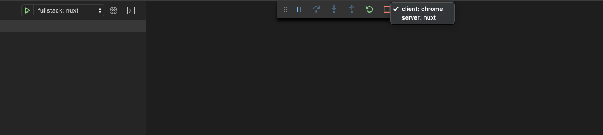

## The Problem

You need an easy way to debug your code through VS Code when working with Nuxt & Typescript.

## The Solution

Utilise Chrome & VS Code to have a better debugging experience. 

Add correct debugger configuration to VS Code & enable chrome debugging extension.

### High-level steps

- Add debugger configs to VS Code.
- Update Nuxt configs to include source map files.
- Add chrome debugging VS Code extension. 
- Test debuggers.

### VS Code Debugger Configurations

We will start by adding the needed debugging configurations to VS Code. This step is necessary to allow VS Code to understand what to do when we start the debugger.

```json
// .vscode/launch.json
{
  "version": "0.2.0",
  "configurations": [
    {
      "type": "chrome",
      "request": "launch",
      "name": "client: chrome",
      "url": "http://localhost:{ADD_YOUR_APP_PORT_HERE}",
      "webRoot": "${workspaceFolder}"
    },
    {
      "type": "node",
      "request": "launch",
      "name": "server: nuxt",
      "args": ["dev"],
      "osx": {
        "program": "${workspaceFolder}/node_modules/.bin/nuxt-ts"
      },
      "linux": {
        "program": "${workspaceFolder}/node_modules/.bin/nuxt-ts"
      }
    }
  ],
  "compounds": [
    {
      "name": "fullstack: nuxt",
      "configurations": ["server: nuxt", "client: chrome"]
    }
  ]
}
```
The JSON file simply defines 2 configurations. 

**client: chrome** is to debug any code that is going to run on the browser side.

**server: nuxt** is to debug any code that is going to run on the server.

Depending on the mode you are running Nuxt in (Universal or SPA) , you might need both configs or only the client one.

The JSON also defines a compound command.

**fullstack: nuxt** combines both configurations and allows you to switch between configs easily without restarting the debugger.

Remember to replace **{ADD_YOUR_APP_PORT_HERE}** with the port of your local development environment.

### Source Map Files

For the debugger to work on the client, the source map files are needed in the browser.

You can let Nuxt know to include the source map files by adding the following to your **nuxt config file**. 

```ts
// nuxt.config.ts
    extend (config: any, ctx: any) {
        if (ctx.isDev) {
          config.devtool = ctx.isClient ? 'source-map' : 'inline-source-map'
        }
    }
```

Obviously we are interested in including the source map files only when we are running nuxt in development mode.

### VS Code Chrome debugger extension

For debugging on the client, we will use chrome and VS Code's debugger.

From the extensions marketplace, search for **[debugger for chrome][1]**.

At the time of writing this post, it was maintained by Microsoft and the extension is by far the most popular result.

Install the extension and restart VS Code.

### Test the debuggers

Run the VS Code debugger - **Make sure that your app is running in the background**. 

You should notice two options when the debugger is running.



Depending on the code you are debugging you can switch between the two options.

That is it folks, happy coding! 👍


[1]: https://marketplace.visualstudio.com/items?itemName=msjsdiag.debugger-for-chrome
