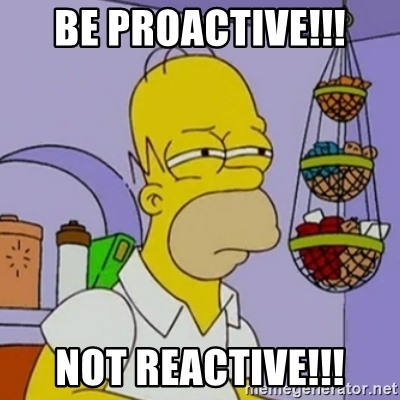
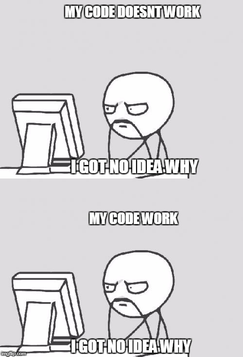
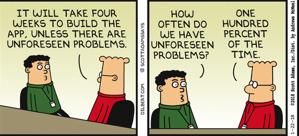

You can find the intro to the post series [here](/on-being-a-pragmatic-programmer-intro).

**Disclaimer**

In an attempt to be a better programmer, the following points are merely my own notes and learnings, for myself, that I found helpful for me to be better at what I do. I am by no means perfect, I am good at some things and bad at others.

I share these notes in hope that somebody would find them helpful in their own journey becoming better at their craft.

# Mentality

Proactive vs reactive. Think what you can do.

## Be Proactive

Be proactive, be in control. I have come across this idea in many of books. Instead of being reactive to the world around me, I should do things **deliberately**. Some of the applications of being proactive as a programmer I learnt:

- Criticize and appraise my work regularly.
- Think solutions, instead of problems. I try to ask myself, what in my control that I can do to fix a problem.
- Seek feedback regularly.

Takeaway: **Be proactive, always think what can I do.**

## Today Not Tomorrow

Being a craftsman is often associated with being a perfectionist. Taking care of details is essential, but...

> **Great** software today is often preferable to perfect software tomorrow. - The Pragmatic Programmer

I hear this statement regularly in my bubble. I mostly agree with the importance of prioritizing delivering results today over tomorrow.

On the other hand, I should not use this as an excuse to produce low quality results. The key word here for me is **great** and **today**.

When can I say now it is great enough? I need to define the minimal acceptable standard that defines my work to be great. These standards should be holistic that consider all the important factors both technical and non-technical. This way I know when my work is in the minimal **great** shape and is good enough to be shipped.

Takeaway: **Great today is almost always better than perfect tomorrow.**
Takeaway: **Define the minimal viable great standard and measure work against it.**

## Knowledge Portfolio

I have the interest in financial markets and investing. There are lots of concepts from the investing world that could be applied to other aspects of life, including building a software. As craftsman I should aim to treat my knowledge in the same manner I manage my assets in a financial portfolio. These are high level strategies that I learnt are applicable to developing knowledge in the software world:

- Invest regularly - Investing is a continuous process not a one time thing.
- Diversify - Diversify my knowledge portfolio with different technologies.
- Manage risk - A balance between new risky technologies and more robust existing technologies.
- Review and rebalance - Rebalance my knowledge portfolio on yearly basis.
- Buy low, sell High - Master a tool when it is still growing. And when it has reached its maximum potential I should go and learn something else.

Takeaway: Manage my knowledge portfolio. Regularly invest, diversify, manage risk and rebalance.

## Be Pessimistic

"**_Can't read value of undefined_** - Oh, but I thought this should never happen!" Does this sound familiar to you?

Every programmer has a set of assumptions that their work is based on. When it comes to assumptions, I learnt that being pessimistic pays off!

For example, if I am developing an application that has an external dependency. I would have specific expectations regarding the data I would receive from these systems. Before processing any data I always have to validate the response given. Not only that I should validate the data, I also should handle cases when the "unexpected" happen. This way I am more confident that my work is more robust and resilient.

Takeaway: **Be pessimistic when writing code.**

## Programming By Coincidence

Program Deliberately - know what your doing and document your assumptions.

I have experienced this exact situation a few times. While this is funny, I really should not be **programming by coincidence**. When making changes in a system, I have to understand the important aspects of the system to be confident to change it. **Unexpected results likely have unexpected side effects**.

For instance, I am a big fan of tools that help me quickly bootstrap a project. While these tools save a lot of time, to be able to use them, I should understand the code the tool created even if I didn't write it myself. This way I can confidently build on top of the code generated and things are not working just by coincidence.

Takeaway: **Know what I am doing and avoid programming by coincidence.**

<!-- ## Ownership and pride

I need to be take ownership of my work and be responsible for the work I produce. I don't refer to only the external responsibilities that my employer has defined. I

We want to see pride of ownership. "I wrote this, and I stand behind my work."

Tip 70: Sign Your Work

Takeaway #8: -->

## Change-friendly Environment

I see a pattern in almost every software project I work in, unexpected things happen and given assumptions change. Business needs and project's requirements are typically always evolving over time.

When I am designing a system or implementing a module, I must leave room for changes. Even if today I am 100% certain that a given assumption won't change. Because the truth is, it changes. Instead of fighting change, I should welcome it and have my work support it.

Takeaway: **Be prepared for the change, create flexible systems.**

Other parts of the series:

- [Part Two - Organization & Team](/on-being-a-pragmatic-programmer-organization-and-team)
- [Part Three - Principles](/on-being-a-pragmatic-programmer-principles)

Credits for the images:

- [Meme Generator](https://memegenerator.net/instance/66450981/simpsons-homer-be-proactive-not-reactive)
- [Imgflip](https://imgflip.com/i/1y5bql)
