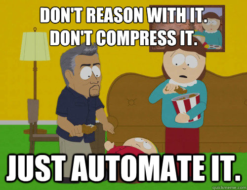
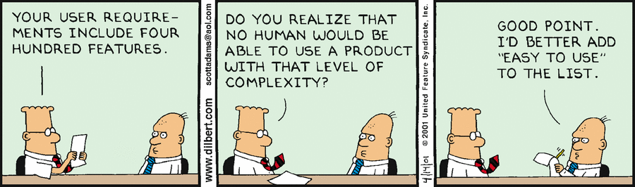

You can find the intro to the post series [here](/on-being-a-pragmatic-programmer-intro).

**Disclaimer**

In an attempt to be a better programmer, the following points are merely my own notes and learnings, for myself, that I found helpful for me to be better at what I do. I am by no means perfect, I am good at some things and bad at others.

I share these notes in hope that somebody would find them helpful in their own journey becoming better at their craft.

# Organization

<h2 id="frog">Dont be a frog</h2>

In the [book](https://amzn.to/2VXGCFL), the authors articulate well how small problems can grow quickly.

Think of a frog. If we throw the frog in a boiling hot water pot, it will jump immediately out. However, if we put it in cool water and heat the water slowly the frog won't notice the temperature changing and will die boiling.

> Don't be a frog.

The point here is, small problems grow to become bigger problems without me noticing. I should fix the small problems immediately or I would be at risk of being the frog.

Takeaway: **Small problems grow to to become bigger problems. I should pay attention to fix my broken windows (small problems) immediately.**

## Speak The Same Language

I have seen many conversations that go something like this:
Engineer person: "I think X needs to be fixed in that way."
Business person: "No, I think Y is more important! Let's fix that".

30 mins later...They realize they are referring to the same thing but with different terms.

Unifying domain language is essential. The same word must carry the same meaning across teams. The domain language should not only be in daily communication but present in the documentation and the code level. This way I would avoid miscommunications, frustrations and I make more friends!

I found one way to make sure teams are on the same page, is to define a glossary of all common domain specific terms.

Takeaway: **Use the correct domain language and document it.**

## Measure It To Manage It,

In many projects I found managing requirements' growth and aligning project's scope tend to be a challenging task.

Often, the challenge is that the team can't see how does a feature impact the schedule of a project. It becomes even more challenging, if the project would have a hard deadline.

Almost always a "yes" to a feature would mean "no" to another feature. To manage requirements and scopes, I must be able to point out the impact of every feature request on the schedule of my project.

Takeaway: **Maintain an environment that supports easily measuring the overall impact of a new change on the project resources and schedule.**

<!-- ## Freedom

I see the value of requirements and specifications and specially documenting them. Specially if there are many stakeholders and project team is large

Degrees of Freedom - The Specification Trap -->

## Automation

> Automation is an essential component of every project team.

Most businesses have two kind of work. First one is the work needed to **operate** the current system and run the daily business operations. Second one is the work needed to **improve** the current system and the daily operations.

As a programmer, I think one of the most valuable things I can bring to a project is automating as much as possible of my work. This is especially valuable to the operative kind of tasks. There are a couple of benefits for automation here.

First, through automation I am able to encapsulate part of my know-how of a given process. I only need to figure out a solution to a problem once and then write some script to do it. This can be really valuable to businesses as they would get reproducible solutions that can be used even after I am long gone from the project.

Second, automating away repeated operative tasks means I am free! I am free to tackle the more challenging, fun, problems. The kind of problems that **improve** the system. This way my life is more interesting at work. Also it takes away some of the stress when dealing with critical things such as deployments. Instead of counting on me remembering to follow the process exactly when I am tired at the end of my work day, I can simply just let the beautiful automated pipeline handle it for me. Good for my health, good for the team, good for the business!

Automation is very powerful. Reoccurring routine operative tasks are always part of my work routine. So there is always room for automating more! Of course I need to know where to draw the line and where it is an overkill, but overall looking for opportunities to automate things really pays off.

Takeaway: **Automate as much as you can!**

## Expectations

In the context of my work, what is success? How to measure it? - One way that works for me, is to measure how well did my work meet the expectations.

> Gently Exceed Your Users' Expectations - The Pragmatic Programmer

Managing expectations can be challenging aspect of work. However, I actively aim to set the right expectations for my work. The right expectations for both my clients and for the end-users of the product (at the time of writing I worked in the IT consultancy business).

Few things that I aim to follow to make sure I set the correct expectations:

- Explain briefly the consequences of high level decisions.
- Simply ask about the current expectations.
- Be a bit pessimistic. Often I am over optimistic, when it comes to planning & estimation.
- Communicate regularly.
- Keep track of the bigger picture & update it if needed.

Takeaway: **Set the right expectations and exceed them.**

# Team

<!-- ## Estimate

Estimate well. 1- understand , 2- model the system, 3- give per part a value, 4- add range. Estimations should be done regularly.

What to Say When Asked for an Estimate
"I'll get back to you."

Challenges
Start keeping a log of your estimates. For each, track how accurate you turned out to be. If your error was greater than 50%, try to find out where your estimate went wrong. -->

## Functionality Over Competence

In a typical project, during the implementation of a feature the workflow goes as follows:

- Requirements are gathered and explained.
- One (or more) developer works on the frontend implementation of the feature.
- One (or more) developer works on the backend implementation of the feature.

The problem here is that this setup is not as efficient. Implementing a feature requires an understanding of the requirements. The higher the number of developers that have to understand and interpret the requirements, the higher the risk the solution deviate from the requirements. Also the given feature would often take longer since multiple people need to coordinate.

It is typical for developers to focus on work that is based on their area of specialization and competence. For instance, in the context of web development I have been mainly focusing on working on the frontend. But I start to see quickly that from the point of view of any project, that is not as optimal. As most features of a system requires working on both the frontend & the backend.

In the debate of specialist vs. generalist, I chose to be a generalist with a specialization. What that means to me is that I choose to focus primarily on specific set of technologies to be build my foundation and deepen my knowledge, but also generally be open and learn other technologies to solve a given problem. This way I can often take ownership of certain features end-to-end.

Of course this would not work all the time, in certain scenarios it makes more sense to focus on the competence if there is a particularly challenging problem that requires a deep understanding and experience of a certain technology.

Takeaway: **Arrange work per functionality over competence.**

## Dig For The Truth

Requirements are rarely easily available so it is part of my duties to just gather them. Typically the root problem is not that easy to find and requires asking lots of "why" questions to get to the bottom of the issue.

Takeaway: **Ask "why" more often to get the real requirements.**

Typically software is built to serve a specific domain. People that build and design the software are not necessarily experts in that domain. Whenever possible, working with a real user makes such a great difference.

When I get such a privilege, I am able to understand a lot better the users' needs, pain points and goals.

Takeaway: **Work with a user whenever is possible.**

## Tightening The Net

I really like this one. It is such a simple idea but had a profound effect on my work.

When a bug is reported, I should add a new test to catch it as part of the fix. Hence tightening the net of tests.

This way, I make sure that the bug is not reported twice, if a similar thing happens in the future, my tests would let me know.

Takeaway: **Find and fix bugs only once.**

Other parts of the series:

- [Part One - Mentality](/on-being-a-pragmatic-programmer-mentality)
- [Part Three - Principles](/on-being-a-pragmatic-programmer-principles)

Credits for the images:

- [Quick meme](http://www.quickmeme.com/meme/3t7r6y)
