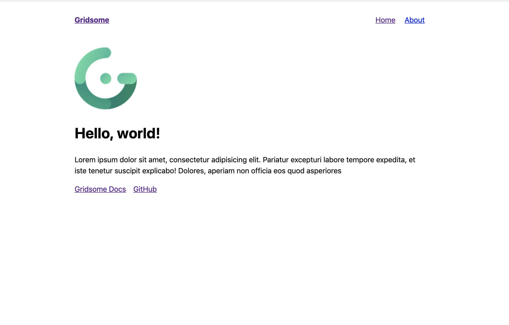

This will be a tutorial showing how to create a simple blog using Vue, Gridsome and Netlify.

In this tutorial I will cover the following stages:

- [Initalize a gridsome project](#initalize)
- [Add Vuetify](vuetify)
- [Include filesystem plugin](#filesystem-plugin)
- [Deploy to Netlify](#netlify)

<h2 id="initalize">Initalize</h2>

First we will need to create a new project by doing the following:

```bash
npx gridsome create the-best-blog
```

In this step, Gridsome will bootstrap your project and install all the dependencies.

The project structure that will generated here will be something like this:

```plaintext
the-best-blog
└───node_modules
└───src
│   └───components
│   └───layouts
│   │   └───Default.vue
│   └───pages
│   │   └───About.vue
│   │   └───Index.vue
│   └───templates
│   └───favicon.png
│   └───main.js
└───static
│───gridsome.config.js
│───gridsome.server.js
│───package.json
│   ...
```

The [Gridsome's Docs](https://gridsome.org/docs/directory-structure) have a good explanation for the important files over there.

Now lets start our dev server:

```bash
gridsome develop
```

You should see something like this:



With this setup you get few things out of the box.

- **Progressive Lazy loading for images** using the ```g-image```component.
- **GraphQL** , You can play around with the explorer by visiting```http://localhost:8080/___explore```

- **Hot reload** development environment.
- **Hot reload** development environment.

<h2 id="vuetify">Vuetify</h2>
<h2 id="filesystem-plugin">Filesystem plugin</h2>
<h2 id="netlify">Netlify</h2>
```
