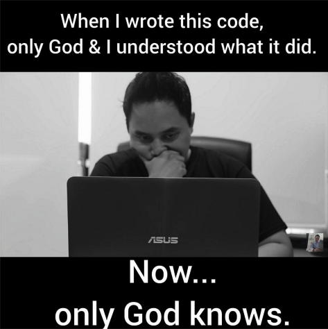

You can find the intro to the post series [here](/on-being-a-pragmatic-programmer-intro).

**Disclaimer**

In an attempt to be a better programmer, the following points are merely my own notes and learnings, for myself, that I found helpful for me to be better at what I do. I am by no means perfect, I am good at somethings and bad at others.

I share these notes in hope that somebody would find them helpful in their own journey of becoming better at their craft.

# Principles

## Shy orthogonal code

I like the term of "shy" code, **shy** in a sense that it doesn't need to know about other parts of the codebase nor communicate with them.

Just like the principle of giving the minimum needed access rights to a user in the security world. Code need to be by default shy and only when its necessary it would get to know about other parts of the application - preferably through an abstracted proxy.

As a result of following this principle more modular code is born.

Takeaway: **Write shy code.**

## DRY and reusability by design

[DRY](https://en.wikipedia.org/wiki/Don%27t_repeat_yourself) (Don't repeat yourself) needs no introduction. It is a principle that is likely familiar to many.

The first challenge I personally encounter is having following DRY by design. How to structure the code in a way that would actually makes it easy not to repeat myself. If I am under tight schedule, it becomes difficult to stick to such principles.

The self talk for me would be something like this...

"You are in a rush now, you can change this later, but now its faster to copy paste that piece of code". But the truth is, in the long run these small issues add up, sometimes exponentially, and it really does bite me back. Plus often it happens that the chance to change the "temporary" code later never comes.

DRY can be violated deliberately or non-deliberately. Sometimes due to lack of awareness, I might end up writing some code that another programmer has wrote earlier but I simply didn't know the code existed.

To stick to DRY I aim to do the following:

- Write code in an acceptable level in terms of allowing reusability **easily**.
- Check before writing new code if **existing code** could be used instead.
- Think of the **long term** consequences before violating the DRY principle.

Takeaway: **Enforce DRY by design.**

## Refactor

Just like cars, the codebase needs regular check-ups and maintenance. Scheduling time dedicated for refactoring the code is important. However, scheduling a long period of time only for refactoring is sometimes unrealistic and therefore risky.

A better approach I found is, doing a little bit everyday. The idea is simple, everytime I work with the code, I aim to make it a little bit better and refactor a small chunk of the code. There are multiple benefits to that approach.

First, the task of refactoring won't be that overwhelming. The example that always come to my mind is cleaning home little by little everyday vs. once over the weekend. Doing little by little decreases the risk of not refactoring as often. But, also I would avoid being [a frog](/on-being-a-pragmatic-programmer-organization-and-team#frog) and risking developing a long-term negative change in my project's culture and standards.

Another benefit, I mitigate the risk of not having time to schedule a long period of time to specifically refactor. Ideally, I would love to have scheduled periods where I can do nothing else but refactor the code. Unfortunately, it often doesn't work like this in real life. There are external factors that may or may not allow for such a luxury.

A helpful practise is to hold regular quality check-ups to have a good high-level overview of where the code stands in terms of quality. Of course peer-reviewing should help maintaining quality but sometimes the bigger picture is difficult to see in regular peer-reviewing sessions. These high-level check-up sessions bring awareness that which areas I should tackle next during my everyday work.

Takeaway: **Leave the codebase a little bit better everytime I work with it.**
Takeaway: **Hold regular high-level code quality check-ups.**

## Ask Why

Working with software involves following a lot of different practices and methods. Best practices are generally good to follow, but **not blindly**.

Whether its an agile methodology or another formal process, I think its important to give these methods a thought first before committing to them. Even if these rituals are considered a best practice, it might simply not make sense in my case.

> Don't Be a Slave to Formal Methods - The pragmatic programmer

Typically, methods and practices are try to solve a problem. I should consider if that particular problem is actually relevant to me and my team. This way, I would follow only methods that are actually beneficial to **my case** in my given circumstance.

Takeaway: **Ask why before adopting a process.**

## Testing Is Compulsory

Regardless of any tight schedules or time pressure, skipping writing tests is not an option. It is simple, either I test the code myself or else my users will.

A couple of things that help me make sure I test my code enough...

First, mentally I tie together the process of writing code and writing tests instead of thinking about them as two separate tasks.

> Coding Ain't Done 'Til All the Tests Run - The pragmatic programmer

Second helpful one is to consider what level of testing one should aim for. I use the following high level principle as a guide for myself.

> Write tests. Not too many. Mostly integration. - [Guillermo Rauch](https://twitter.com/rauchg)

Takeaway: **Testing is not optional.**

## Share Reasons

In the documentation process, writing code comments serve many purposes. One particular aspect of comments that I should aim to maintain is sharing the "why" side of things. It becomes very helpful to write down why a piece of code is doing what it does especially if it reflects a business process.

Usually the "what" and the "how" are expressed by the code itself but the "why" sometimes can be unclear. For example, if there is a corner case that the code handles, a couple of sentences explaining the corner case and why the code does what it does would be very helpful.

Such comments become helpful to both other developers and myself. To other developers that would work on the codebase now or maintain it in the future. To my future self when I at look at the code two months from now and wonder "what the hell is this".

Takeaway: **Always document the "why" side of the code.**

Other parts of the series:

- [Part One - Mentality](/on-being-a-pragmatic-programmer-mentality)
- [Part Two - Organization & Team](/on-being-a-pragmatic-programmer-organization-and-team)

Credits for the images:
- [me.me](https://me.me/i/when-wrote-this-code-only-god-l-understood-what-13073974)
