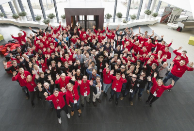
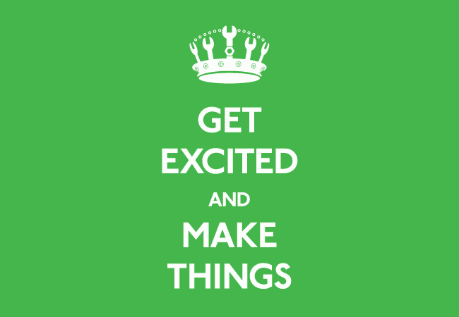
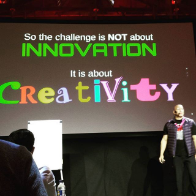

For those who have not tried joining a hackathon before, you should consider it. You will have fun, learn a ton of new stuff (technical and non-technical), expand your network by meeting new interesting people, and get to know your coworkers better if you go together. For those who work in a field that has anything to do with IT, go ahead and poke your managers to let you form a team and join.

Ok that was the short version, here is a little bit longer version

I work primarily as a software developer in Tieto. Mostly my work involve creating custom web based solutions to different customers of Tieto . Every project is a new story, a new industry, new challenges, and new technology stack to solve these challenges.

I need to be aware of different new tools that fit best to the challenges of the project. Those of you who do software development know how crazy fast things are changing. I also need to gain the domain knowledge of the customer’s business. Sometimes it is challenging but it always fulfills my curiosity and ensures a no boredom policy at work.

I had the chance to participate in quite a few hackathons last year and it was such a rich experience. By sharing some of my experiences I am hoping to motivate you to think of joining these kinds of events. Personally for me the goal is to develop myself on both the professional and the personal level.

## What is a hackathon?

In case you do not know what I am talking about and you are wondering.

According to Wikipedia it is

> A hackathon (also known as a hack day, hackfest or codefest) is a design sprint-like event in which computer programmers and others involved in software development, including designers, managers, and others, often including subject-matter-experts, collaborate intensively on software projects.

It is often thought that such events are only for programmers or people who are directly working with technology but I disagree. **Regardless of your background I think you would learn something by attending a hackathon**. Especially when you think of how IT is involved in almost every industry and service.

## Why you should care

Lets agree on something that Wayne Gretzky said awhile back.

> You miss 100% of the shots you do not take.

With keeping that in mind let me demonstrate what is in it for you and why you should join it at all.

### New tools and technologies

Hackathons always offer accessibility to different set of tools for contestants. The nature of these tools vary a lot depending on the challenges offered and varies from all kinds of **software** and **hardware**. I have played around with things like drones, sensors, open APIs, data, VR sets, and more. Sometimes you can have access to things which are not even available for public yet and still under development phase.

It doesn’t matter much what is your background or what you do for living, there is always something interesting there to try out and perhaps utilize it to come up with a new use case for some of these tools.

**_Picture taken during CargoHack, where we had access to the latest REAL cargo handling machines, drones, sensors and more interesting gadgets._**

### Re-activate your creative brain cells

I like to think of participation in hackathons as a workout to my creative mind. During the event typically you get exposed to an environment where you have a challenge, different set of tools, and people resources to assist you. This is where you can practice your creativity by thinking of new solutions. Typically participants try utilizing different known tools together and come up with a creative new solution to a specific problem.

I was present in a presentation in one of the hackathons, Ultrahack. The main idea was how the current and future generations need to count on their creativity as their main assist.

The main argument was about the importance of creative work with the rise of the machines, creative jobs are in more demand than ever. So far it has been the case that computers are still lacking behind with tasks that require creativity.

Another argument was that coming up with a major innovative solution is far less likely compared to a creative solution. An average person is likely to come up with a new use case of the smartphone but innovating the first smartphone is way less common.

**_Bruce Oreck at Ultrahack 2016 and his presentation about creativity._**

A study by George Land, suggest that everyone is creative by nature when they were born but it kind of fades away along the way while growing up. In addition, the process of coming up with a creative solution is something that is not familiar to everybody.

To conclude, practicing your creativity is crucial and very much needed and participating in similar events can help with that.

### Team bonding

I have attended multiple hackathons last year together with some my colleagues where we formed a team from Tieto. After the weekend was over, it was often that I got to know my team well and it made any future cooperation at work easier.

It is usually not a requirement to attend the event in a team. However, if you get to attend a hackathon with some colleagues, classmates or friends it will definitely have a positive impact on the team.

### Gain new domain knowledge

Typically any solution focus some pain-point to some stakeholder. This requires diving deep into the details of the main problem and its different dimensions. I find it fascinating how much I always learn about a specific field or industry just by participating in couple of days hackathon. Also, usually the knowledge acquired over the weekend translates to different fields as well.

Some of the focus areas in the hackathons I attended were:

development of intelligent cargo handling — **Cargohack**
human-centric personal data trend and its implication — **MyData**
advancements in the the financial sector using different technologies — **Ultrahack**

**one example from previous experience:**

During the first hackathon, Cargohack, our team tried to tackle the problem of the cargo handling machine maintenance. Surprisingly there is a lot of manual work involved in that process and much room for creative digital solutions.

Domain knowledge was absolutely necessary to tackle this issue. We started with interviewing different people who actually work in that area. Next thing was to analysis the main pain points and the available tools that could potentially be used.

Our solution was proposing a set of tools that allow monitoring the machines, predicts failures based on historical data and current machines’ state, and also give the chance to act upon different actions. We utilized things drones, sensors, data science algorithms.

**_A UI vision of our team’s solution in Cargohack_**

After that dense experience it was quite interesting how much I learned about the cargo and shipping industry that personally I did not know much about.

### It’s FUN

_new people + food + drinks + sauna_ = **FUN**

To me the above equation usually works, guess it’s true to some of you out there.

You get to expand your network and meet people with all sorts of backgrounds. When you decide to take a break from assembling your idea together you can start networking. Typically every evening there has been some time where participants could get together and mingle. Most of the hackathons I attended were held in Finland, and of course there was always sauna available which I personally enjoy, A LOT.

### Sometimes you even get to win something!

Hackathons usually have different variety of prizes in form of money, new tech gear, paid trips, etc.

The value and the motive for joining is of course not the prize but it’s always nice to win something, and sometimes the winner is YOU!

I was participating in the Ultrahack MyData hackathon last year together with three other colleagues from Tieto. The hackathon was about the MyData initiative to help people gain more control over their personal data. Our idea in a nutshell was to create a marketplace to monetize personal data. It was quite competitive environment but guess what, our team won one of the prizes!

 DATA was the one of the top 5 finalist.")

**_Our team — SELL YOUR (SOUL) DATA was the one of the top 5 finalist._**

---

To summarize, just the fact that you are actively participating makes you a winner. Whether your goal:

- Scout for what is new in terms of technology and advancement in different fields.
- Get inspired and energized.
- Give your creative mind a workout.
- Meet new people and expand your network.
- Simply have fun.

joining a hackathon will have you covered.

I hope you found this helpful and perhaps you decided to form a team and attend a hackathon. See you in one of the next coming ones.
